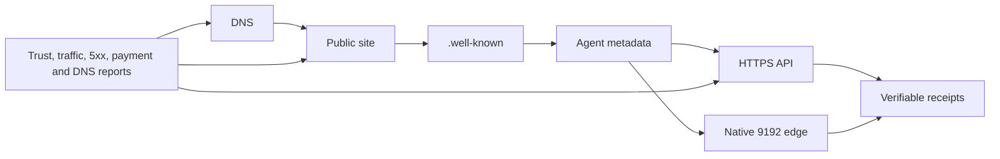

# 9192 Discovery Map

- Generated: 2026-05-27T08:15:03.1719100-04:00
- Domain: nineoneninetwo.com.br
- Overall: REVIEW
- Public route/file issues: 0
- Report issues: 1
- Report warnings: 3

## Public checks
- [OK] public_files / agent-directory.json: size=480 updated=2026-05-25T21:56:31
- [OK] public_files / agents.json: size=685 updated=2026-05-25T21:56:31
- [OK] public_files / dns reputation policy: size=2352 updated=2026-05-25T21:56:31
- [OK] public_files / first-test.html: size=2846 updated=2026-05-26T02:21:14
- [OK] public_files / llms.txt: size=5448 updated=2026-05-25T21:59:23
- [OK] public_files / mcp.json: size=642 updated=2026-05-25T21:56:31
- [OK] public_files / privacy.html: size=3566 updated=2026-05-25T23:23:12
- [OK] public_files / robots.txt: size=860 updated=2026-05-26T02:22:54
- [OK] public_files / sitemap.xml: size=3837 updated=2026-05-26T02:22:47
- [OK] public_routes / agent directory: HTTP 200 https://nineoneninetwo.com.br/agent-directory.json
- [OK] public_routes / agents json: HTTP 200 https://nineoneninetwo.com.br/agents.json
- [OK] public_routes / api status: HTTP 200 https://nineoneninetwo.com.br/api/v1/status
- [OK] public_routes / discovery map page: HTTP 200 https://nineoneninetwo.com.br/discovery-map
- [OK] public_routes / first test page: HTTP 200 https://nineoneninetwo.com.br/first-test
- [OK] public_routes / home: HTTP 200 https://nineoneninetwo.com.br/
- [OK] public_routes / llms txt: HTTP 200 https://nineoneninetwo.com.br/llms.txt
- [OK] public_routes / mcp endpoint: HTTP 200 https://nineoneninetwo.com.br/mcp
- [OK] public_routes / mcp json: HTTP 200 https://nineoneninetwo.com.br/mcp.json
- [OK] public_routes / privacy page: HTTP 200 https://nineoneninetwo.com.br/privacy
- [OK] public_routes / sitemap: HTTP 200 https://nineoneninetwo.com.br/sitemap.xml
- [OK] public_routes / status page: HTTP 200 https://nineoneninetwo.com.br/status
- [OK] public_routes / well-known agents: HTTP 200 https://nineoneninetwo.com.br/.well-known/agents.json
- [OK] public_routes / well-known mcp card: HTTP 200 https://nineoneninetwo.com.br/.well-known/mcp/server-card.json

## Report summaries
- operational_trust: overall=DEGRADED generated=2026-05-27T08:00:05.4229750-04:00
- traffic: overall=WARN generated=2026-05-27T08:05:09.4374212-04:00
- five_xx_watch: overall=OK generated=2026-05-27T08:06:03.3171816-04:00
- dns_reputation: overall=WARN generated=2026-05-27T08:10:04.3658304-04:00
- discovery_conversion: overall=GOOD generated=2026-05-26T22:39:48.9533516-04:00
- payment_rail_status: overall=OK generated=2026-05-27T04:30:16.0021744-04:00
- executive_status: overall=WARN generated=2026-05-26T23:56:01.5720947-04:00

## Discovery edges
- dns -> site: domain resolves to public HTTPS
- site -> well_known: site links machine-readable metadata
- well_known -> agents: agents discover capabilities
- agents -> api: HTTP clients can start with JSON endpoints
- agents -> edge: native clients can connect to 9192/1
- api -> receipts: sandbox and quote flows produce verifiable receipts
- edge -> receipts: native execution returns verifiable receipts
- reports -> dns: DNS reputation tracks public discoverability
- reports -> site: traffic, 5xx and trust reports watch public access
- reports -> api: executive and payment reports summarize readiness for operation
